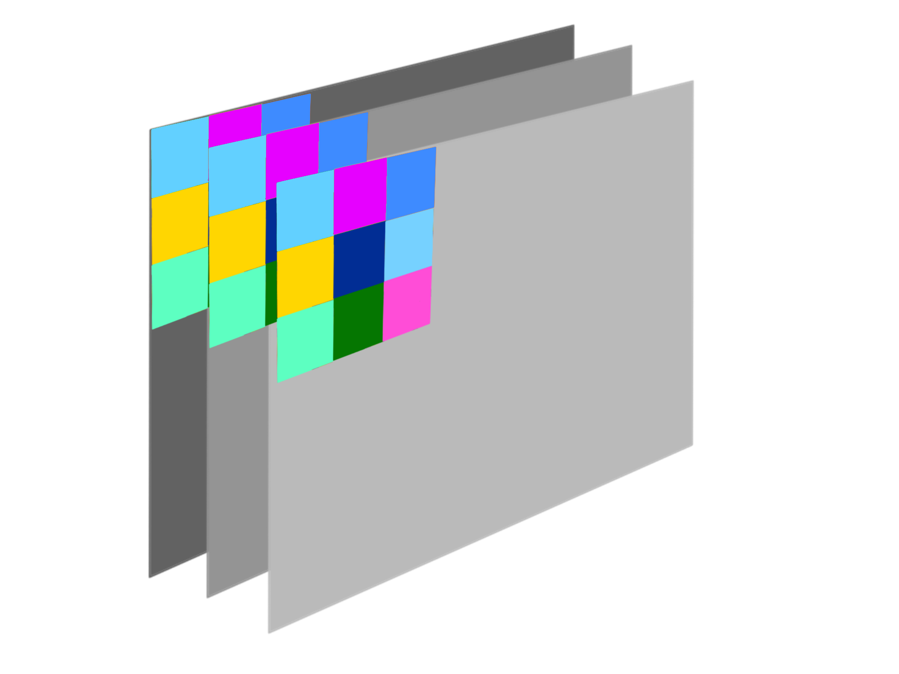
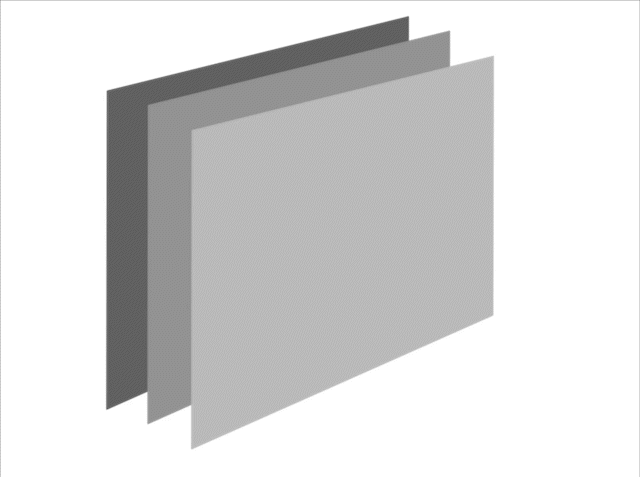

# Involution
This repository contains re-Implementation of https://arxiv.org/abs/2103.06255

### Involution Kernal

<div style="display: flex; justify-content: center;">
  <div>
    
    <p align="center">Channel Agnostic</p>
  </div>
  <div>
    
    <p align="center">Spatial Specific</p>
  </div>
</div>

The authors of _Involution: Inverting the Inherence of Convolution for Visual Recognition_ propose a novel involutional layers, which aims to enhance the representation power of convolutional neural networks by inverting the inherent properties of convolution operations. As such these kernals are channel agnostic and spatial specific.

### Usage

```python
from models.rednet import RedNet

rednet50 = RedNet(50) # 50 layer Rednet model
```
### Folders

```models``` contains implementation of backbone models introduced the paper and related heads and neck architectures.

```notebooks``` contains main python notebooks for training and testing.

### To Do
